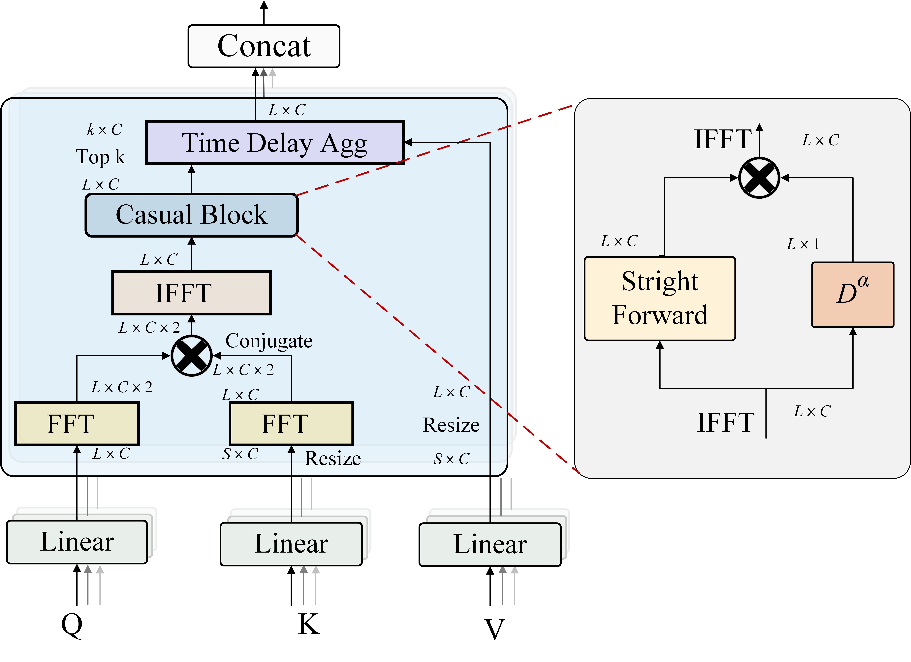
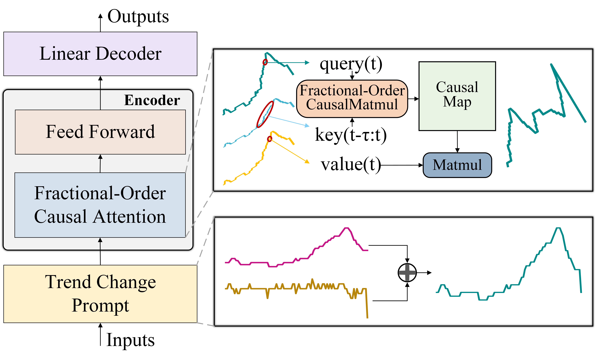
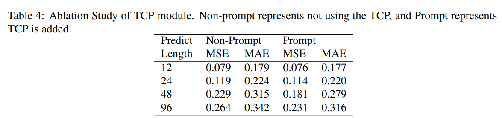
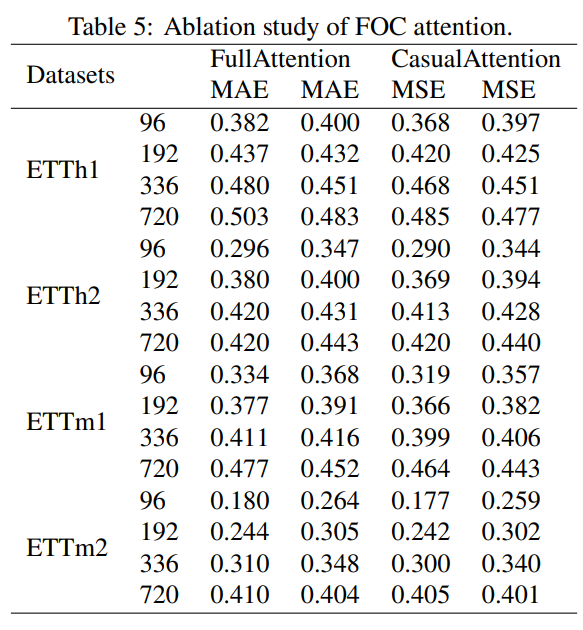

# FOCformer
> **[Multivariate Forecasting](./scripts/multivariate_forecasting/README.md)**: We provide all scripts as well as datasets for the reproduction of forecasting results in this repo.

> **[Boosting Forecasting of Transformers](./scripts/boost_performance/README.md)**:  FOCformer framework can consistently promote Transformer variants, and take advantage of the booming efficient attention mechanisms.

> **[Generalization on Unseen Variates](scripts/variate_generalization/README.md)**: FOCformer is demonstrated to generalize well on unseen time series, making it a nice alternative as the fundamental backbone of the large time series model.

> **[Adopt Causal Attention](scripts/model_efficiency/README.md)**: Fractional-order causal attention mechanisms is developed to enhence the local correlation on high-dimensional time series.
 
# Updates
## Introduction

🌟 Considering the characteristics of multivariate time series, FOCformer takes local causal correlation among time series into account by fractional-oreder calculas and make a improvement in predicting.

<p align="center">

</p>

😊 **FOCformer** is repurposed on the iTransformer. We think Transformer has got too much attention in the research area of time series. Hopefully, the mainstream work in the following can focus more on the insight of dataset and consider the essence of Transformer.


## Overall Architecture

FOCformer regards **independent time series as variate tokens** to **capture local causal correlations by fractional-order causal attention** and **utilize trend change prompt to learn series overall information**.

<p align="center">

</p>


## Usage 

1. Install Pytorch and necessary dependencies.

```
pip install -r requirements.txt
```

1. The datasets is in folder './data/'.

2. Train and evaluate the model. We provide all the above tasks under the folder ./scripts/. You can reproduce the results as the following examples:

```
# Multivariate forecasting with FOCformer
bash ./scripts/multivariate_forecasting/ETT/FOCformer.sh


## Main Result of Multivariate Forecasting
We evaluate the FOCformer on extensive challenging multivariate forecasting benchmarks. **Comprehensive good performance** (MSE/MAE) is achieved by FOCformer. FOCformer is particularly good at forecasting low-dimensional time series.

# Long-term Prediction
<p align="center">

</p>

# Short-term Prediction
<p align="center">

</p>


## Model Abalations

FOCformer that utilizes fractional-order causal attention on variate dimensions and trend change prompt generally achieve the overall best performance. 

<p align="center">

</p>

<p align="center">

</p>


## Acknowledgement

We appreciate the following GitHub repos a lot for their valuable code and efforts.
- Autoformer (https://github.com/thuml/Autoformer)
- FEDformer (https://github.com/thuml/Nonstationary_Transformers)
- Preforemr (https://github.com/ddz16/Preformer)
- Time-Series-Library (https://github.com/thuml/Time-Series-Library)
- PatchTST (https://github.com/yuqinie98/PatchTST)
- iTransformer (https://github.com/thuml/iTransformer)

## Contact

If you have any questions or want to use the code, feel free to contact:
* Zhou Chengli (chenglizhou@mail.ynu.edu.cn)
* Zhao Chunna (zhaochunna@ynu.edu.cn)
